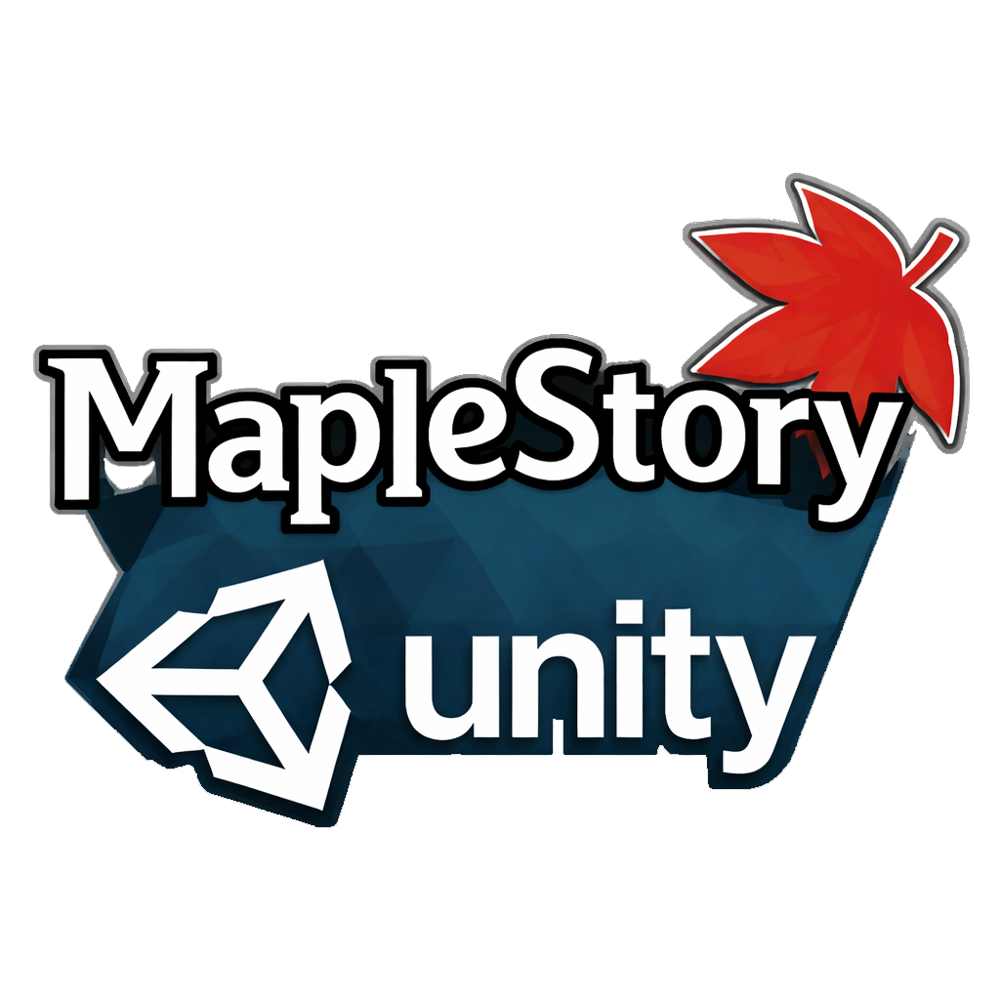

  
  

    
    
    
    
    
  

  

    
    
  

> A framework to build MapleStory MMO RPG games.

## 🚧 State of the project

We are currently in a *early development* phase.  API, functionalities and game mechanics are not stable.

Things might still break at any point.

## 📌 Dependencies

- [UnityWzLib](https://github.com/MapleStoryUnity/UnityWzLib)
- [JCSUnity](https://github.com/jcs090218/JCSUnity)
- [Mx](https://github.com/jcs090218/Unity.Mx)

## 🔨 Development

### 🔍 Prepare wz files

Make sure you have placed all `.wz` files to `wz` folder from the
root of the project directory.

## ⚜️ License

This program is free software; you can redistribute it and/or modify
it under the terms of the GNU General Public License as published by
the Free Software Foundation, either version 3 of the License, or
(at your option) any later version.

This program is distributed in the hope that it will be useful,
but WITHOUT ANY WARRANTY; without even the implied warranty of
MERCHANTABILITY or FITNESS FOR A PARTICULAR PURPOSE.  See the
GNU General Public License for more details.

You should have received a copy of the GNU General Public License
along with this program.  If not, see <https://www.gnu.org/licenses/>.

See [`LICENSE`](./LICENSE) for details.
